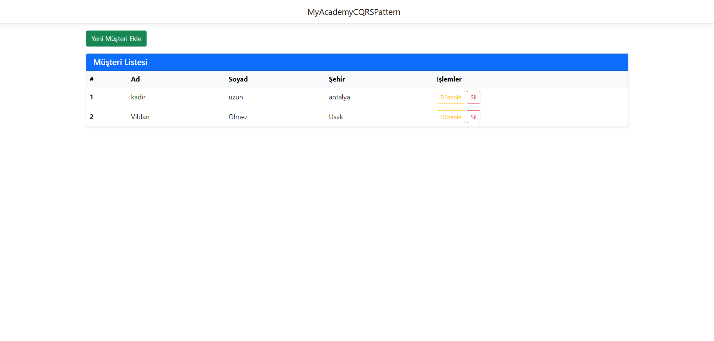
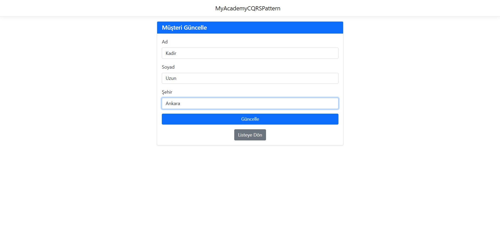
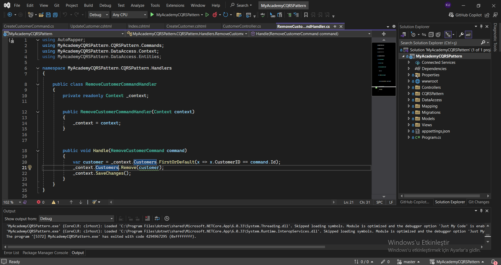

!\[.NET Core](https://img.shields.io/badge/.NET%20Core-CQRS%20Project-512BD4?logo=dotnet\&logoColor=white)

!\[Design Pattern](https://img.shields.io/badge/Architecture-CQRS%20Pattern-blue)

!\[Bootcamp](https://img.shields.io/badge/Bootcamp-M%26Y%20Akademi-ff69b4)

!\[Operations](https://img.shields.io/badge/Operations-CRUD-brightgreen)

\# 🏢 MyAcademy CQRS Pattern Mini Project

Bu proje, \*\*M\&Y Yazılım Eğitim Akademi Danışmanlık\*\* bünyesindeki \*Full Stack .Net Core Development Bootcamp\* süreci kapsamında geliştirilmiş mimari odaklı bir mini projedir.

Projenin temel amacı; kurumsal yazılım mimarilerinde sıkça tercih edilen \*\*CQRS\*\* tasarım desenini kavramak ve Müşteri teması üzerinden temel \*\*CRUD\*\* (Ekleme, Okuma, Güncelleme, Silme) operasyonlarını bu mimariye uygun olarak gerçekleştirmektir.

\---

\## 📸 Proje Ekran Görüntüleri ve Mimari

\### 👥 Müşteri Yönetimi (UI)

&#x20; 

&#x20; \&nbsp;

&#x20; 

\&nbsp;

&#x20; 

\### 🧩 CQRS Klasör Yapısı ve Kod Organizasyonu

&#x20; 

\---

\## 🚀 Proje Özellikleri

\* \*\*Müşteri Yönetimi:\*\* Müşteri kayıtlarının oluşturulması, listelenmesi, güncellenmesi ve silinmesi (CRUD).

\* \*\*Sorumlulukların Ayrılması:\*\* Her bir Command ve Query için özel Handler (İşleyici) sınıflarının yazılması.

\* \*\*Temiz Kod (Clean Code):\*\* SOLID prensiplerine uygun, karmaşıklıktan uzak kod organizasyonu.

\---

\## 🛠 Kullanılan Teknolojiler

| Kategori | Teknoloji / Kavram |

| :--- | :--- |

| \*\*Platform\*\* | ASP.NET Core |

| \*\*Tasarım Deseni\*\* | CQRS (Command Query Responsibility Segregation) |

| \*\*Operasyonlar\*\* | Müşteri CRUD İşlemleri |

\---

